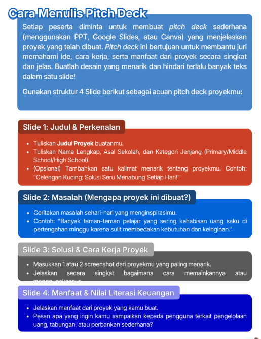
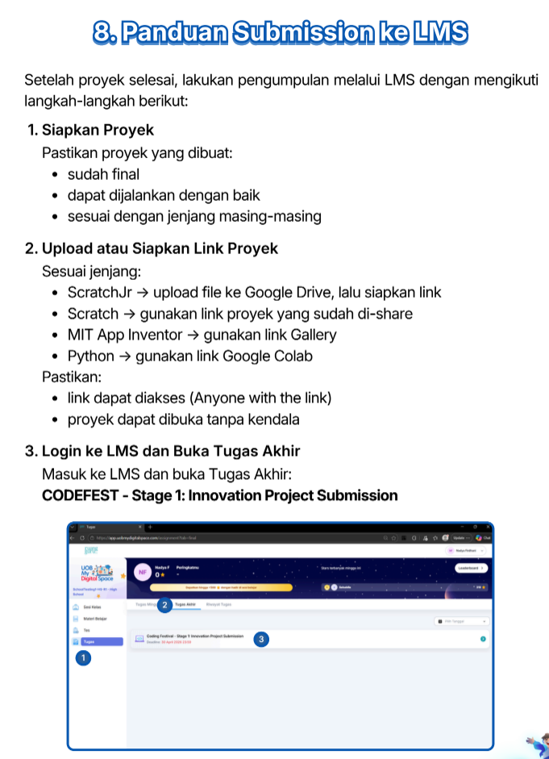
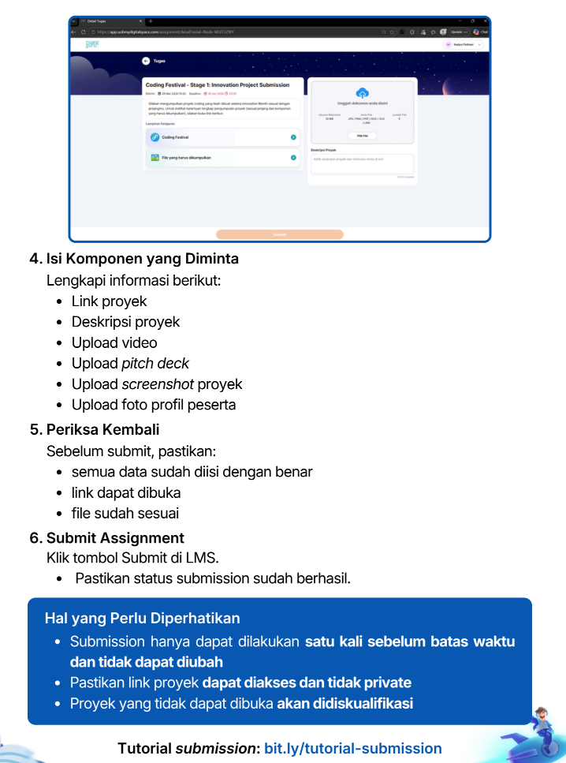

    <h1>Tutorial Mengumpulkan Project Coding Fest</h1>

    

        <h2>A. Yang dikumpulkan:</h2>
        <ol>
            <li>Video saat memainkan proyek</li>
            <li>Deskripsi proyek yang ditulis langsung di LMS</li>
            <li>Screenshot proyek untuk thumbnail digital exhibition</li>
            <li>Foto profil peserta</li>
            <li>Pitch deck (PPT/Slides/Canva) yang menjelaskan detail proyek yang dibuat</li>
        </ol>
        
        

            <a href="https://docs.google.com/presentation/d/1fq4Y_wUFctFsCtQbWqHlVkqMG28jr1D0/edit?usp=sharing&ouid=114931242218283411698&rtpof=true&sd=true" target="_blank" class="button">Download PPT/Pitch Deck</a>
            <a href="https://canva.link/no7cab9bjfycl1j" target="_blank" class="button">Lihat Contoh PPT/Pitch Deck</a>
            <a href="https://drive.google.com/drive/folders/1FWgNhvRqt2ivZIJm96ffEnivQbLad3PN?usp=sharing" target="_blank" class="button">Download Logo</a>
            <a href="https://drive.google.com/file/d/1G621nK3idn8T6nXsmRAYc7xrYar6hcke/view?usp=drive_link" target="_blank" class="button">Informasi Lebih Detail (Guide)</a>
        

    

    

        <h2>B. Panduan Submit ke LMS</h2>
        
        
        

            <a href="http://bit.ly/ContohSubmissionPart1" target="_blank" class="button">Contoh Submission Proyek</a>
            <a href="http://bit.ly/tutorial-submission" target="_blank" class="button">Tutorial Share Proyek MIT App Inventor</a>
        

    

