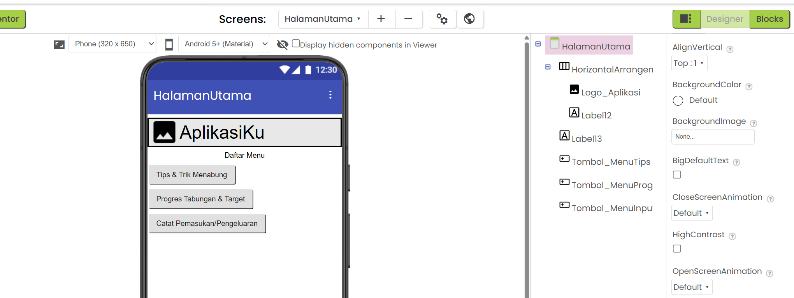
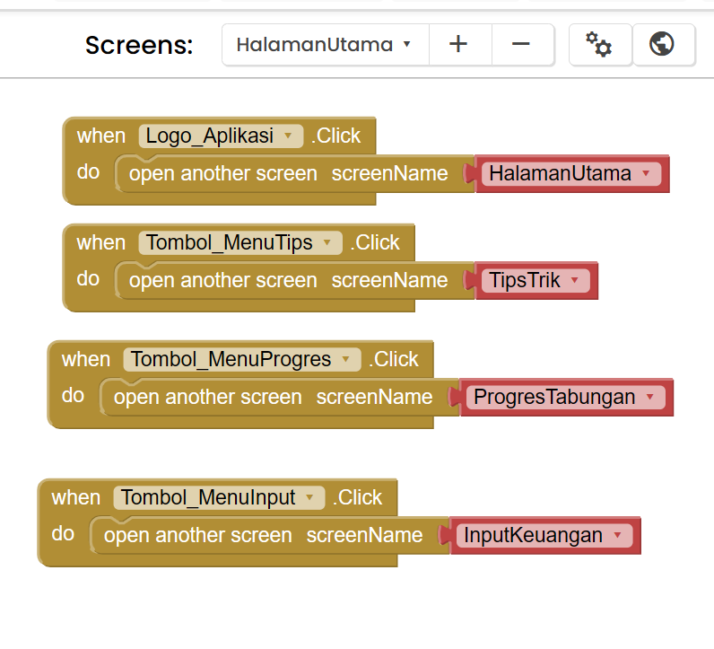
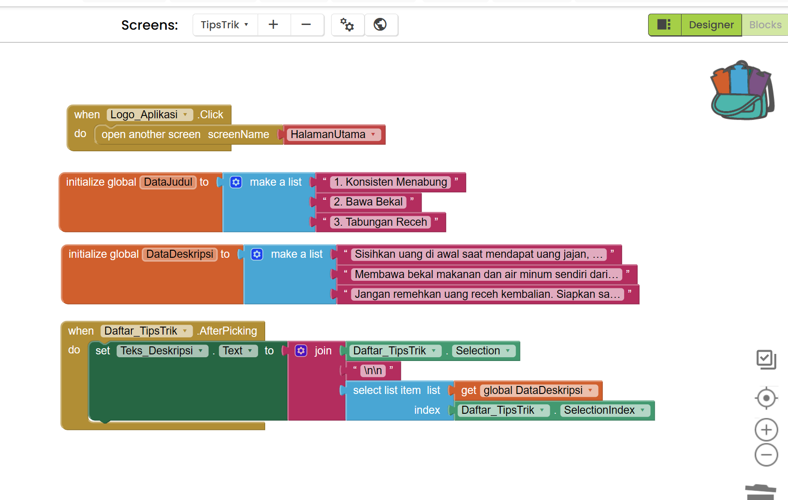

# Tutorial Membuat Aplikasi KELOMPOK 1 dengan MIT App Inventor

Pastikan Anda sudah login ke MIT App Inventor dan berada di tampilan **Designer** (tombol di pojok kanan atas).

Karena Anda sudah selesai dengan `Screen1` (Login), kita akan melanjutkan pembuatan 4 Screen baru untuk menu Tips, Progres, dan Pencatatan Keuangan.

---

## TAHAP 1: Membuat Screen Baru

Kita perlu membuat 4 Screen baru sesuai konsep Anda.

1. Di bagian atas layar, klik tombol **Add Screen**.
2. Ketik nama: `HalamanUtama` lalu klik OK.
3. Ulangi langkah 1, ketik nama: `TipsTrik` lalu klik OK.
4. Ulangi langkah 1, ketik nama: `ProgresTabungan` lalu klik OK.
5. Ulangi langkah 1, ketik nama: `InputKeuangan` lalu klik OK.

_(Catatan: Pastikan penulisan nama Screen persis seperti di atas tanpa spasi)._

> **PENTING:** Silakan coba Run program, untuk memeriksa aplikasi apakah sudah benar tanpa error belum. Apabila ada error jangan lanjut ke tahap berikutnya.

---

## TAHAP 2: Desain & Blocks - HalamanUtama

Pastikan screen aktif di bagian atas adalah **HalamanUtama**. Di sini kita akan membuat Header dengan Logo terlebih dahulu (yang nanti akan kita copy ke layar lain), baru kemudian membuat 3 tombol menu utama.

### A. Desain (Designer)

**Preview Desain:**

1. **Membuat Header & Logo (Untuk di-copy nanti):**
   - Dari panel **Palette** > **Layout**, tarik **HorizontalArrangement** ke layar bagian paling atas.
   - Dari **Palette** > **User Interface**, tarik komponen **Image** ke dalam kotak HorizontalArrangement tadi.
   - Di panel **Components**, klik tombol **Rename Component** pada gambar tersebut, ubah namanya menjadi: `Logo_Aplikasi`.
   - Di panel **Properties**, cari kotak centang bernama **Clickable** dan **wajib dicentang** (agar logo bisa ditekan).
   - _(Opsional)_ Tarik **Label** di sebelah logo jika ingin memberi teks judul aplikasi.
2. **Membuat Tombol 1 (Tips & Trik):** - Tarik komponen **Button** ke bawah header.
   - Ubah **Text** menjadi: `Tips & Trik Menabung`. Lalu klik **Rename Component** menjadi: `Tombol_MenuTips`.
3. **Membuat Tombol 2 (Progres Tabungan):** - Tarik **Button** lagi. Ubah **Text** menjadi: `Progres Tabungan & Target`. Klik **Rename Component** menjadi: `Tombol_MenuProgres`.
4. **Membuat Tombol 3 (Pemasukan & Pengeluaran):** - Tarik **Button** lagi. Ubah **Text** menjadi: `Catat Pemasukan/Pengeluaran`. Klik **Rename Component** menjadi: `Tombol_MenuInput`.

### B. Kode (Blocks)

**Preview Blocks:**

Pindah ke tampilan **Blocks**.

1. **Logika Logo (Kembali ke Home):** Klik `Logo_Aplikasi` di panel kiri, tarik `when Logo_Aplikasi.Click do`. Dari kategori **Control**, tarik `open another screen screenName`. Isi dengan teks pink `"HalamanUtama"`. _(Blok ini juga akan ikut tercopy ke halaman lain nanti)._
2. **Menu Tips:** Klik `Tombol_MenuTips`, tarik `when Tombol_MenuTips.Click do`. Tarik blok buka layar, isi dengan teks pink `"TipsTrik"`.
3. **Menu Progres:** Klik `Tombol_MenuProgres`, tarik blok buka layar, isi dengan teks pink `"ProgresTabungan"`.
4. **Menu Input:** Klik `Tombol_MenuInput`, tarik blok buka layar, isi dengan teks pink `"InputKeuangan"`.

> **PENTING:** Silakan coba Run program untuk memeriksa perpindahan layar.

---

## TAHAP 3: Desain & Blocks - TipsTrik

Ganti screen aktif ke **TipsTrik**. Di sini kita akan membuat daftar list yang bisa diklik untuk membaca deskripsi tips yang berbeda-beda.

### A. Desain (Designer)

**Preview Desain:**

1. **Copy-Paste Header:**
   - Ganti screen kembali ke `HalamanUtama` sebentar.
   - Klik komponen `HorizontalArrangement` (Header) yang berisi Logo Anda.
   - Tekan tombol **Ctrl + C** (Copy) di keyboard Anda.
   - Ganti screen ke `TipsTrik`. Tekan tombol **Ctrl + V** (Paste). Header dan Logo akan otomatis muncul beserta blok logikanya!
2. **Membuat Daftar Judul:**
   - Dari **Palette** > **User Interface**, tarik komponen **ListView** ke layar di bawah header.
   - Di panel **Properties**, ubah **Height** menjadi `30 Percent` (agar tidak memakan seluruh layar).
   - Klik **Rename Component** menjadi: `Daftar_TipsTrik`.
3. **Membuat Wadah Deskripsi:**
   - Dari **Palette** > **Layout**, tarik **ScrollVerticalArrangement** ke bawah ListView tadi.
   - Di Properties, set **Height** dan **Width** menjadi `Fill Parent`.
4. **Menyiapkan Teks Deskripsi:**
   - Di dalam kotak scroll tersebut, tarik sebuah **Label**.
   - Klik **Rename Component** menjadi: `Teks_Deskripsi`.
   - Di panel Properties, ubah teks bawaannya menjadi: `Silakan klik salah satu judul tips di atas untuk membaca detailnya.`

### B. Kode (Blocks)

**Preview Blocks:**

Pindah ke tampilan **Blocks**. Kita akan membuat dua buah _List_ (satu untuk Judul, satu untuk Deskripsi), lalu menghubungkannya.

**Bagian 1: Membuat Data Judul dan Deskripsi**

1. Di kategori **Variables** (oranye tua), tarik blok `initialize global name to`. Ganti `name` jadi `DataJudul`.
   - Pasangkan dengan blok biru muda dari kategori **Lists**: `make a list`.
   - Klik ikon gir biru, tambahkan 1 item lagi agar memiliki 3 lubang. Isi dengan teks pink `" "`, lalu ketik 3 judul berbeda. Contoh: `"1. Konsisten Menabung"`, `"2. Bawa Bekal"`, `"3. Tabungan Receh"`.
2. Tarik lagi blok `initialize global name to`. Ganti `name` jadi `DataDeskripsi`.
   - Pasangkan dengan blok `make a list` (buat 3 lubang lagi).
   - Isi dengan teks pink `" "` berisi deskripsi panjang sesuai urutan judul di atas. _(Pastikan jumlah judul dan deskripsi sama banyak)_.

**Bagian 2: Menampilkan Judul saat Layar Dibuka**

1. Di panel kiri, klik **TipsTrik**, tarik blok kuning: `when TipsTrik.Initialize do`.
2. Klik `Daftar_TipsTrik`, tarik blok hijau muda: `set Daftar_TipsTrik.Elements to` dan masukkan ke blok kuning.
3. Dari kategori **Variables**, tarik blok merah `get`, pilih `global DataJudul` dan pasangkan ke blok hijau tadi.

**Bagian 3: Menampilkan Deskripsi saat Judul Diklik**

1. Klik `Daftar_TipsTrik`, tarik blok kuning: `when Daftar_TipsTrik.AfterPicking do`.
2. Klik `Teks_Deskripsi`, tarik blok hijau muda: `set Teks_Deskripsi.Text to`. Masukkan ke dalam blok kuning tadi.
3. Kita akan menggabungkan Judul dan Deskripsinya. Dari kategori **Text**, tarik blok `join`. Buat agar punya 3 lubang (pakai ikon gir biru).
4. Isi ke-3 lubang blok `join` secara berurutan:
   - **Lubang 1:** Klik `Daftar_TipsTrik`, tarik blok hijau tua `Daftar_TipsTrik.Selection` (Ini akan memunculkan judul yang baru saja diklik).
   - **Lubang 2:** Tarik blok teks pink `" "`, ketik `\n\n` _(untuk membuat 2 baris baru/Enter ke bawah)_.
   - **Lubang 3:** Dari kategori **Lists**, tarik blok biru muda `select list item list index`.
     - Di bagian `list`: isi dengan blok orange `get global DataDeskripsi`.
     - Di bagian `index`: klik `Daftar_TipsTrik`, tarik blok hijau tua `Daftar_TipsTrik.SelectionIndex`. _(Ini berfungsi agar deskripsi yang dipanggil urutannya cocok dengan judul yang diklik)._

## CATATAN

1. **Tips/Trik** Tidak boleh sama dengan contoh.

---

## TAHAP 3.5: Revisi Halaman Utama & Tambah Screen Baru

Karena kita memutuskan untuk memisah halaman Pemasukan dan Pengeluaran, kita perlu membuat layarnya dan menyesuaikan tombol di Halaman Utama. _(Catatan: Screen `InputKeuangan` yang lama bisa diabaikan atau dihapus saja)._

1. **Membuat Screen Baru:**
   - Di bagian atas layar, klik tombol **Add Screen**. Ketik nama: `Pemasukan` lalu klik OK.
   - Ulangi, klik **Add Screen**. Ketik nama: `Pengeluaran` lalu klik OK.
2. **Revisi Tombol di Halaman Utama:**
   - Ganti screen aktif ke **HalamanUtama**.
   - Di panel Components, klik `Tombol_MenuInput`. Klik **Rename**, ubah namanya menjadi `Tombol_MenuPemasukan`. Di panel Properties, ubah **Text** menjadi: `Input Pemasukan`.
   - Dari panel **Palette**, tarik satu **Button** lagi ke bawah tombol Pemasukan. Ubah **Text** menjadi: `Input Pengeluaran`. Klik **Rename** menjadi: `Tombol_MenuPengeluaran`.
3. **Revisi Blocks Halaman Utama:**
   - Pindah ke tampilan **Blocks**.
   - Cari blok kuning `when Tombol_MenuPemasukan.Click`. Ubah teks pink di dalamnya yang tadinya `"InputKeuangan"` menjadi `"Pemasukan"`.
   - Di panel kiri, klik `Tombol_MenuPengeluaran`. Tarik blok kuning `when Tombol_MenuPengeluaran.Click do`. Tarik blok `open another screen screenName` dan isi dengan teks pink `"Pengeluaran"`.

---

## TAHAP 4: Desain & Blocks - Pemasukan

Ganti screen aktif ke **Pemasukan**. Di sini kita membuat form input uang masuk beserta riwayat transaksinya.

### A. Desain (Designer)

1. **Paste Header:** Tekan **Ctrl + V** (Paste) di keyboard agar Header dan Logo kembali muncul di atas layar.
2. **Input Keterangan:** Tarik **TextBox**. Ubah Hint menjadi: `Keterangan (Contoh: Uang Saku)`. Rename menjadi: `Input_KeteranganMasuk`.
3. **Input Nominal:** Tarik **TextBox** ke bawahnya. Centang kotak _NumbersOnly_. Ubah Hint menjadi: `Nominal Pemasukan`. Rename menjadi: `Input_NominalMasuk`.
4. **Tombol Simpan:** Tarik **Button**. Ubah Text menjadi: `Simpan Pemasukan`. Rename menjadi: `Tombol_SimpanPemasukan`.
5. **Daftar Riwayat:** Tarik komponen **ListView**. Rename menjadi: `Daftar_Pemasukan`.
6. **Alat Tambahan:** Tarik komponen **TinyDB** (Rename: `Database_Utama`) dan **Notifier** (Rename: `Pesan_Notif`).

### B. Kode (Blocks)

Pindah ke tampilan **Blocks**.

**1. Menyiapkan Variabel & Menampilkan Riwayat Lama:**

- Di kategori **Variables**, tarik blok `initialize global name to`. Ganti `name` jadi `RiwayatMasuk`. Pasangkan dengan blok `create empty list` (dari kategori Lists).
- Di panel kiri, klik layar **Pemasukan** (ikon HP paling atas). Tarik blok kuning `when Pemasukan.Initialize do`.
- Klik **Variables**, tarik blok `set to` pilih `global RiwayatMasuk`. Pasangkan dengan blok ungu `call Database_Utama.GetValue`.
  - Isi `tag` dengan teks pink `"DataPemasukan"`.
  - Isi `valueIfTagNotThere` dengan blok biru muda `create empty list`.
- Klik `Daftar_Pemasukan`, tarik blok hijau muda `set Daftar_Pemasukan.Elements to`. Pasangkan dengan blok merah `get global RiwayatMasuk` dan taruh di bawah susunan Initialize tadi.

**2. Logika Tombol Simpan:**

- Klik `Tombol_SimpanPemasukan`, tarik blok kuning `when Tombol_SimpanPemasukan.Click do`.
- **Tambah Total Saldo:** - Tarik blok ungu `call Database_Utama.StoreValue`. Isi `tag` dengan teks pink `"TotalPemasukan"`.
  - Di `valueToStore`, pasangkan blok Math tambah `+`.
  - Sisi kiri blok `+`: tarik `call Database_Utama.GetValue` (tag: `"TotalPemasukan"`, default: `0`). Sisi kanan blok `+`: tarik blok hijau tua `Input_NominalMasuk.Text`.
- **Tambah ke Riwayat:**
  - Dari kategori Lists, tarik blok `add items to list`.
  - Bagian `list`: isi dengan blok merah `get global RiwayatMasuk`.
  - Bagian `item`: tarik blok pink `join` (buat jadi 3 lubang). Lubang 1 isi dengan `Input_KeteranganMasuk.Text`. Lubang 2 isi dengan teks pink `" - Rp "`. Lubang 3 isi dengan `Input_NominalMasuk.Text`.
- **Simpan & Tampilkan Riwayat:**
  - Tarik blok ungu `call Database_Utama.StoreValue`. Isi `tag` dengan teks pink `"DataPemasukan"`. Isi `valueToStore` dengan blok merah `get global RiwayatMasuk`.
  - Klik `Daftar_Pemasukan`, tarik blok hijau muda `set Daftar_Pemasukan.Elements to` dan pasangkan dengan blok merah `get global RiwayatMasuk`.
- **Notifikasi:** Tarik blok ungu `call Pesan_Notif.ShowAlert notice`. Isi dengan teks pink `"Pemasukan Berhasil Disimpan!"`.

---

## TAHAP 5: Desain & Blocks - Pengeluaran

Ganti screen aktif ke **Pengeluaran**. Tahap ini hampir sama persis dengan Pemasukan.

### A. Desain (Designer)

1. **Paste Header:** Tekan **Ctrl + V** (Paste).
2. **Input Keterangan:** Tarik **TextBox**. Ubah Hint: `Keterangan (Contoh: Beli Makan)`. Rename: `Input_KetKeluar`.
3. **Input Nominal:** Tarik **TextBox**. Centang _NumbersOnly_. Ubah Hint: `Nominal Pengeluaran`. Rename: `Input_NominalKeluar`.
4. **Tombol Simpan:** Tarik **Button**. Ubah Text: `Simpan Pengeluaran`. Rename: `Tombol_SimpanPengeluaran`.
5. **Daftar Riwayat:** Tarik **ListView**. Rename: `Daftar_Pengeluaran`.
6. **Alat Tambahan:** Tarik **TinyDB** (Rename: `Database_Utama`) dan **Notifier** (Rename: `Pesan_Notif`).

### B. Kode (Blocks)

Pindah ke **Blocks**. Ikuti pola yang sama seperti Pemasukan.

**1. Menyiapkan Variabel & Menampilkan Riwayat:**

- Buat variabel global `RiwayatKeluar` isi dengan `create empty list`.
- Gunakan blok kuning `when Pengeluaran.Initialize do`. Set `global RiwayatKeluar` dengan GetValue tag `"DataPengeluaran"` (default list kosong). Tampilkan ke `Daftar_Pengeluaran.Elements`.

**2. Logika Tombol Simpan:**

- Gunakan blok kuning `when Tombol_SimpanPengeluaran.Click do`.
- **Total:** `StoreValue` tag `"TotalPengeluaran"` dengan menjumlahkan `GetValue` ("TotalPengeluaran") ditambah `Input_NominalKeluar.Text`.
- **Riwayat:** Gunakan `add items to list` ke `global RiwayatKeluar`. Itemnya `join` (`Input_KetKeluar.Text`, `" - Rp "`, `Input_NominalKeluar.Text`).
- **Simpan & Tampilkan:** `StoreValue` tag `"DataPengeluaran"` dengan isi `global RiwayatKeluar`. Update `Daftar_Pengeluaran.Elements`.
- **Notifikasi:** ShowAlert `"Pengeluaran Berhasil Dicatat!"`.

---

## TAHAP 6: Desain & Blocks - ProgresTabungan

Ganti screen aktif ke **ProgresTabungan**. Ini adalah tahap akhir untuk melihat rangkuman saldo dan membuat target impian.

### A. Desain (Designer)

1. **Paste Header:** Tekan **Ctrl + V** (Paste) di keyboard agar Header dan Logo kembali muncul di atas layar.
2. **Saldo Otomatis:** Tarik **Label**. Ubah Text menjadi: `Saldo Saat Ini: Rp 0`. Perbesar ukuran font dan centang FontBold. Rename Component menjadi: `Teks_SaldoOtomatis`.
3. **Wadah Input Target:** Dari panel **Layout**, tarik **VerticalArrangement**. Rename Component menjadi: `Wadah_Input`. Di dalam kotak ini, tarik 3 **TextBox** dan 1 **Button**:
   - TextBox 1 -> Hint: `Nama Barang`, Rename Component: `Input_NamaBarang`.
   - TextBox 2 -> Hint: `Nominal Target`, Centang _NumbersOnly_, Rename Component: `Input_NominalTarget`.
   - TextBox 3 -> Hint: `Tanggal Target`, Rename Component: `Input_TanggalTarget`.
   - Button -> Text: `Simpan Target`. Rename Component: `Tombol_SimpanTarget`.
4. **Wadah Info Target:** Tarik **VerticalArrangement** baru ke bawah layar. Rename Component menjadi: `Wadah_Info`.
   - **PENTING:** Di panel Properties `Wadah_Info`, hilangkan centang **Visible** (agar disembunyikan saat pertama dibuka).
   - Di dalam kotak ini, tarik 3 **Label** berurutan ke bawah. Rename Component masing-masing menjadi: `Teks_InfoNama`, `Teks_InfoNominal`, `Teks_InfoTanggal`.
   - Tarik 1 **Button** ke dalam wadah ini. Ubah Text: `Hapus & Buat Baru Target`. Rename Component: `Tombol_HapusTarget`.
5. **Alat Tambahan:** Tarik **TinyDB** (Rename Component: `Database_Utama`) dan **Notifier** (Rename Component: `Pesan_Notif`).

### B. Kode (Blocks)

Pindah ke tampilan **Blocks**.

**Bagian 1: Saat Layar Dibuka (Menghitung Saldo & Cek Target)**

1. Di panel kiri, klik `ProgresTabungan` (ikon layar paling atas). Tarik blok kuning: `when ProgresTabungan.Initialize do`.
2. **Hitung Saldo:** - Klik `Teks_SaldoOtomatis` di panel kiri, tarik blok hijau muda: `set Teks_SaldoOtomatis.Text to` dan masukkan ke dalam blok kuning tadi.
   - Klik kategori **Text** (warna pink), tarik blok `join` dan pasangkan ke sebelah kanan blok hijau tadi.
   - Di lubang pertama blok `join`: klik kategori **Text**, tarik blok teks pink kosong `" "`, lalu ketik di dalamnya: `Saldo Saat Ini: Rp ` (pastikan ada spasi setelah huruf p).
   - Di lubang kedua blok `join`: klik kategori **Math** (biru muda), tarik blok kurang `-`.
   - Di sisi kiri blok `-`: klik `Database_Utama` di panel kiri, tarik blok ungu `call Database_Utama.GetValue`. Isi `tag`-nya dengan blok teks pink `" "` dan ketik: `TotalPemasukan`. Isi `valueIfTagNotThere` dengan angka `0` dari kategori **Math**.
   - Di sisi kanan blok `-`: tarik lagi blok ungu `call Database_Utama.GetValue`. Isi `tag`-nya dengan blok teks pink `" "` dan ketik: `TotalPengeluaran`. Isi `valueIfTagNotThere` dengan angka `0` dari kategori **Math**.
3. **Cek Kondisi Target:** - Klik kategori **Control** (warna cokelat), tarik blok `if then else` dan pasangkan di bawah blok hijau `set Saldo` (masih di dalam blok kuning Initialize).
   - **Di bagian `if`:** Klik kategori **Logic** (hijau terang), tarik blok sama dengan `=`.
     - Sisi kiri blok `=`: tarik blok ungu `call Database_Utama.GetValue`. Isi `tag`-nya dengan teks pink `"Target_Nama"`. Isi `valueIfTagNotThere` dengan teks pink kosong `" "`.
     - Sisi kanan blok `=`: tarik blok teks pink kosong `" "` dari kategori **Text**. (Ini mengecek apakah memori nama target masih kosong).
   - **Di bagian `then` (Jika belum ada target):** - Klik `Wadah_Input`, tarik blok hijau muda `set Wadah_Input.Visible to`. Pasangkan blok dari kategori **Logic** yaitu `true`.
     - Klik `Wadah_Info`, tarik blok hijau muda `set Wadah_Info.Visible to`. Pasangkan blok dari kategori **Logic** yaitu `false`.
   - **Di bagian `else` (Jika target sudah ada):** - Klik `Wadah_Input`, tarik blok hijau muda `set Wadah_Input.Visible to`. Pasangkan blok `false`.
     - Klik `Wadah_Info`, tarik blok hijau muda `set Wadah_Info.Visible to`. Pasangkan blok `true`.
     - _(Menampilkan data target dari database)_: Klik `Teks_InfoNama`, tarik `set Teks_InfoNama.Text to`. Pasangkan dengan blok ungu `call Database_Utama.GetValue`. Isi `tag`-nya dengan teks pink `"Target_Nama"`, dan `valueIfTagNotThere` dengan teks pink `" "`. Lakukan langkah yang sama persis untuk `Teks_InfoNominal` (tag: `"Target_Nominal"`) dan `Teks_InfoTanggal` (tag: `"Target_Tanggal"`).

**Bagian 2: Tombol Simpan Target**

1. Di panel kiri, klik `Tombol_SimpanTarget`, tarik blok kuning `when Tombol_SimpanTarget.Click do`.
2. Klik `Database_Utama`, tarik blok ungu `call Database_Utama.StoreValue`. Pasangkan ke dalam blok kuning. Ulangi sampai ada **3 blok ungu StoreValue** tersusun ke bawah.
   - Blok ungu ke-1: Isi `tag` dengan teks pink `"Target_Nama"`. Isi `valueToStore` dengan klik `Input_NamaBarang`, lalu tarik blok hijau tua `Input_NamaBarang.Text`.
   - Blok ungu ke-2: Isi `tag` dengan teks pink `"Target_Nominal"`. Isi `valueToStore` dengan blok hijau tua `Input_NominalTarget.Text`.
   - Blok ungu ke-3: Isi `tag` dengan teks pink `"Target_Tanggal"`. Isi `valueToStore` dengan blok hijau tua `Input_TanggalTarget.Text`.
3. **Notifikasi:** Klik `Pesan_Notif`, tarik blok ungu `call Pesan_Notif.ShowAlert notice`. Pasang di bawah susunan tadi. Isi `notice`-nya dengan teks pink `"Target Berhasil Dibuat!"`.
4. **Ganti Tampilan:**
   - Klik `Wadah_Input`, tarik `set Wadah_Input.Visible to` dan isi dengan blok logika `false`.
   - Klik `Wadah_Info`, tarik `set Wadah_Info.Visible to` dan isi dengan blok logika `true`.
5. **Update Teks di Layar:**
   - Klik `Teks_InfoNama`, tarik `set Teks_InfoNama.Text to`, lalu pasangkan dengan blok hijau tua `Input_NamaBarang.Text`. Lakukan hal yang sama untuk `Teks_InfoNominal` (ambil dari `Input_NominalTarget.Text`) dan `Teks_InfoTanggal` (ambil dari `Input_TanggalTarget.Text`).

**Bagian 3: Tombol Hapus Target**

1. Di panel kiri, klik `Tombol_HapusTarget`, tarik blok kuning `when Tombol_HapusTarget.Click do`.
2. Klik `Database_Utama`, tarik blok ungu `call Database_Utama.StoreValue`.
   - Isi `tag` dengan teks pink `"Target_Nama"`.
   - Isi `valueToStore` dengan blok teks pink kosong `" "`. (Ini berfungsi menghapus data di memori sehingga dianggap kosong).
3. **Balikkan Tampilan Layar:**
   - Klik `Wadah_Input`, tarik `set Wadah_Input.Visible to` dan isi dengan blok logika `true`.
   - Klik `Wadah_Info`, tarik `set Wadah_Info.Visible to` dan isi dengan blok logika `false`.

---

## CATATAN AKHIR

1. **Jangan lupa di save** project Anda.
2. **Coba jalankan secara penuh:** Input Pemasukan, lalu input Pengeluaran. Setelah itu buka menu Progres Tabungan, pastikan saldonya terpotong/bertambah secara otomatis!
3. **Desain:** Anda bisa mempercantik warna tombol dan ukuran teks setelah semua fungsi blok berjalan lancar.
