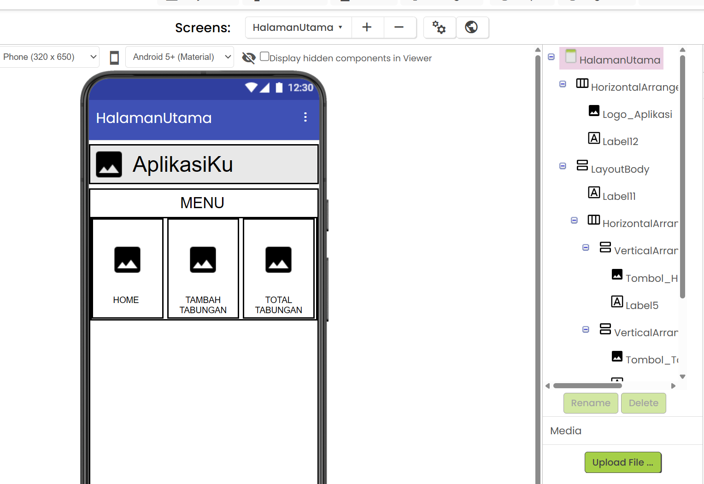
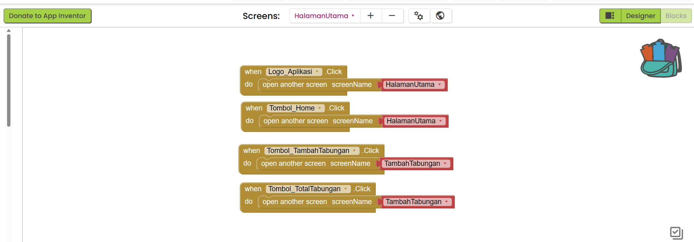
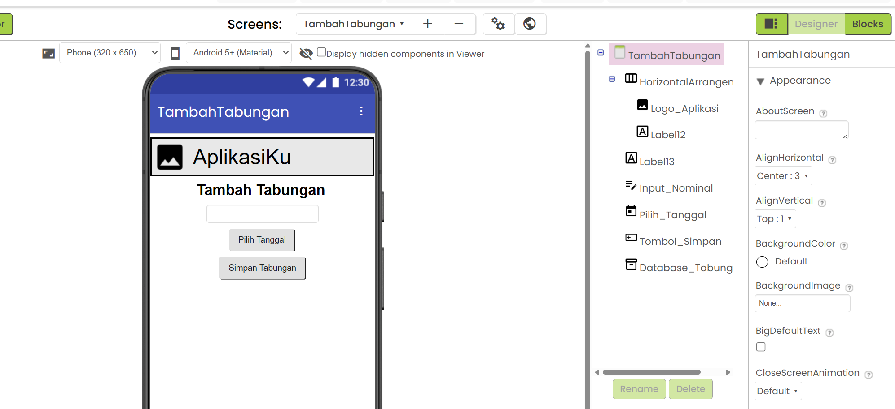
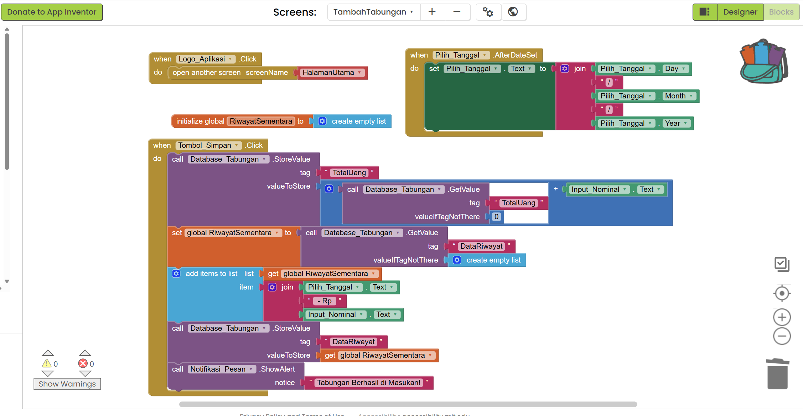
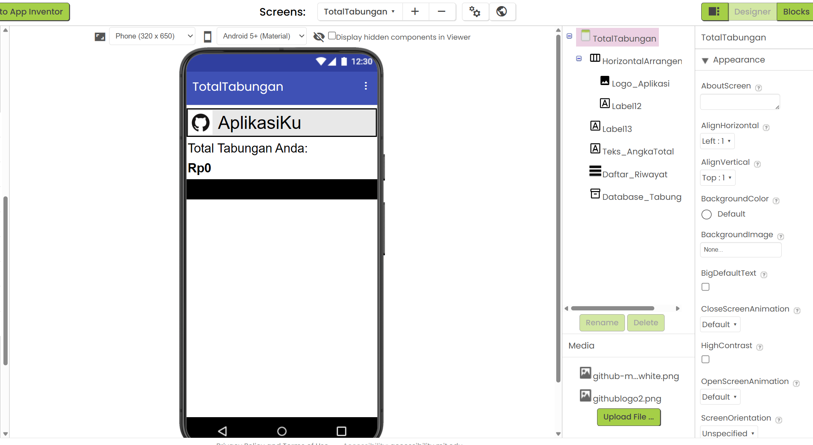
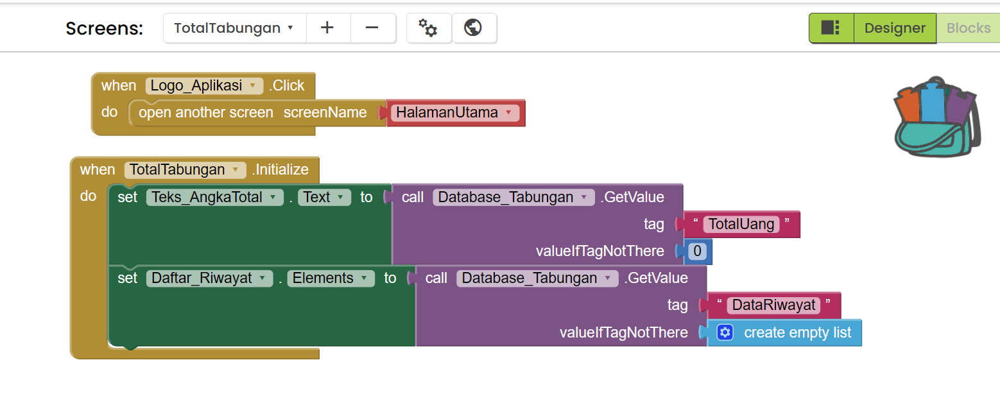

# Tutorial Membuat Aplikasi KELOMPOK 2 dengan MIT App Inventor

Pastikan Anda sudah login ke MIT App Inventor dan berada di tampilan **Designer** (tombol di pojok kanan atas).

---

## TAHAP 1: Membuat Screen Baru

Karena Anda sudah selesai dengan `Screen1` yang berisi login, kita perlu melanjutkannya untuk membuat 3 Screen baru sesuai konsep Anda.

1. Di bagian atas layar, klik tombol **Add Screen**.
2. Ketik nama: `HalamanUtama` lalu klik OK.
3. Ulangi langkah 1, ketik nama: `TambahTabungan` lalu klik OK.
4. Ulangi langkah 1, ketik nama: `TotalTabungan` lalu klik OK.

_(Catatan: Pastikan penulisan nama Screen persis seperti di atas tanpa spasi, karena huruf besar/kecil sangat berpengaruh di App Inventor)._

> **PENTING:** Silakan coba Run program, untuk memeriksa aplikasi apakah sudah benar tanpa error belum. Apabila ada error jangan lanjut ke tahap berikutnya.

---

## TAHAP 2: Desain & Blocks - HalamanUtama

Pastikan di bagian atas layar App Inventor, Anda sedang berada di Screen **HalamanUtama**. Jika Anda sudah menyusun layout (menggunakan Horizontal/Vertical Arrangement) seperti pada gambar, kita akan fokus mengatur komponen gambarnya.

**Preview Desain:**

### A. Desain (Designer)

1. **Mengatur Logo Aplikasi:**
   - Di panel **Components** (sebelah kanan), cari dan klik komponen gambar logo Anda.
   - Klik tombol **Rename** di bawahnya, ubah namanya menjadi: `Logo_Aplikasi`.
   - Turun ke panel **Properties** (paling kanan), cari kotak centang bernama **Clickable** dan **wajib dicentang**. (Ini agar logo bisa ditekan).
   - Di bagian **Picture**, upload dan pilih gambar logo Anda.

2. **Mengatur Menu Home:**
   - Di panel **Components**, klik komponen gambar untuk menu Home (terletak di dalam susunan menu pertama).
   - Klik **Rename**, ubah namanya menjadi: `Tombol_Home`.
   - Di panel **Properties**, centang kotak **Clickable**.
   - Di bagian **Picture**, pilih gambar ikon Home.

3. **Mengatur Menu Tambah Tabungan:**
   - Di panel **Components**, klik komponen gambar untuk menu Tambah Tabungan.
   - Klik **Rename**, ubah namanya menjadi: `Tombol_TambahTabungan`.
   - Di panel **Properties**, centang kotak **Clickable**.
   - Di bagian **Picture**, pilih gambar ikon Tambah Tabungan.

4. **Mengatur Menu Total Tabungan:**
   - Di panel **Components**, klik komponen gambar untuk menu Total Tabungan.
   - Klik **Rename**, ubah namanya menjadi: `Tombol_TotalTabungan`.
   - Di panel **Properties**, centang kotak **Clickable**.
   - Di bagian **Picture**, pilih gambar ikon Total Tabungan.

---

### B. Kode (Blocks)

Sekarang kita buat agar gambar-gambar tersebut berfungsi memindahkan layar saat ditekan. Pindah ke tampilan Blocks (klik tombol **Blocks** di pojok kanan atas).

**Preview Blocks:**

**1. Logika Logo Aplikasi & Home (Kembali ke Halaman Utama)**

- Di panel **Blocks** sebelah kiri, klik `Logo_Aplikasi`.
- Tarik blok kuning paling atas: `when Logo_Aplikasi.Click do`.
- Klik kategori **Control** (warna cokelat/oranye). Scroll ke bawah, tarik blok `open another screen screenName`. Pasangkan ke dalam blok kuning tadi.
- Klik kategori **Text** (warna pink), tarik blok string kosong `" "` (paling atas) dan pasangkan ke sebelah `screenName`. Ketik di dalamnya: `HalamanUtama`.
- Ulangi langkah di atas untuk `Tombol_Home`. (Klik `Tombol_Home`, tarik `when Tombol_Home.Click do`, lalu pasang blok buka layar ke `HalamanUtama`).

**2. Logika Menu Tambah Tabungan**

- Di panel kiri, klik `Tombol_TambahTabungan`.
- Tarik blok kuning: `when Tombol_TambahTabungan.Click do`.
- Klik kategori **Control**, tarik blok `open another screen screenName` dan pasangkan ke dalam blok kuning.
- Klik kategori **Text**, tarik blok `" "`, pasangkan dan ketik: `TambahTabungan`.

**3. Logika Menu Total Tabungan**

- Di panel kiri, klik `Tombol_TotalTabungan`.
- Tarik blok kuning: `when Tombol_TotalTabungan.Click do`.
- Klik kategori **Control**, tarik blok `open another screen screenName` dan pasangkan ke dalam blok kuning.
- Klik kategori **Text**, tarik blok `" "`, pasangkan dan ketik: `TotalTabungan`.

> **PENTING:** Silakan coba Run program, untuk memeriksa aplikasi apakah sudah benar tanpa error belum. Apabila ada error jangan lanjut ke tahap berikutnya.

---

## TAHAP 3: Desain & Blocks - TambahTabungan

Ganti screen aktif ke **TambahTabungan** melalui dropdown Screen di atas.

**Preview Desain:**

### A. Desain (Designer)

1. **Input Nominal:** Dari panel **Palette** > **User Interface**, tarik komponen **TextBox** ke layar.
   - Di **Properties**, centang kotak **NumbersOnly** (agar keyboard angka yang muncul).
   - Ubah **Hint** menjadi: `Masukkan Nominal (contoh: 50000)`.
   - Klik **Rename**, ubah menjadi: `Input_Nominal`.
2. **Input Tanggal:** Dari **Palette** > **User Interface**, tarik komponen **DatePicker**.
   - Di **Properties**, ubah **Text** menjadi: `Pilih Tanggal`.
   - Klik **Rename**, ubah menjadi: `Pilih_Tanggal`.
3. **Tombol Simpan:** Dari **Palette** > **User Interface**, tarik komponen **Button**.
   - Di **Properties**, ubah **Text** menjadi: `Simpan Tabungan`.
   - Klik **Rename**, ubah menjadi: `Tombol_Simpan`.
4. **Database:** Dari **Palette**, scroll ke bawah, klik kategori **Storage**. Tarik **TinyDB** ke layar (dia akan muncul di bawah layar sebagai _Non-visible component_).
   - Klik **Rename**, ubah menjadi: `Database_Tabungan`.
5. **Pesan Notifikasi:** Dari panel **Palette** > **User Interface**, tarik komponen **Notifier** ke layar (dia juga akan muncul di bawah layar sebagai _Non-visible component_).
   - Klik **Rename**, ubah menjadi: `Notifikasi_Pesan`.

### B. Kode (Blocks)

Pindah ke tampilan **Blocks**. Kita butuh beberapa logika di sini.

**Preview Blocks:**

**Bagian 1: Menampilkan Tanggal yang Dipilih**

1. Di panel kiri, klik `Pilih_Tanggal`. Tarik blok kuning: `when Pilih_Tanggal.AfterDateSet do`.
2. Klik lagi `Pilih_Tanggal`, scroll ke bawah, tarik blok hijau muda: `set Pilih_Tanggal.Text to`. Masukkan ke dalam blok kuning.
3. Klik kategori **Text** (pink), tarik blok `join` dan pasangkan ke blok hijau tadi.
4. Klik ikon gir biru kecil pada blok `join`. Tarik kotak `string` tambahan ke kanan, sehingga blok `join` memiliki 5 lubang kosong.
5. Isi ke-5 lubang tersebut secara berurutan dari atas ke bawah dengan cara:
   - Lubang 1: Klik `Pilih_Tanggal`, tarik blok hijau tua `Pilih_Tanggal.Day`.
   - Lubang 2: Kategori **Text**, tarik blok pink `" "`, ketik garis miring `/`.
   - Lubang 3: Klik `Pilih_Tanggal`, tarik blok hijau tua `Pilih_Tanggal.Month`.
   - Lubang 4: Kategori **Text**, tarik blok pink `" "`, ketik garis miring `/`.
   - Lubang 5: Klik `Pilih_Tanggal`, tarik blok hijau tua `Pilih_Tanggal.Year`.

**Bagian 2: Menyimpan Data saat Tombol Simpan Diklik**

1. Klik `Tombol_Simpan`, tarik blok kuning `when Tombol_Simpan.Click do`.
2. **Simpan Total Uang:**
   - Klik `Database_Tabungan`, tarik blok ungu `call Database_Tabungan.StoreValue`. Masukkan ke blok kuning.
   - Di bagian `tag`, pasangkan teks pink `" "` dan ketik: `TotalUang`.
   - Di bagian `valueToStore`, kita harus menambahkan total lama dengan input baru. Klik kategori **Math** (biru muda), tarik blok tambah `+`.
   - Di lubang pertama blok `+`: klik `Database_Tabungan`, tarik blok ungu `call Database_Tabungan.GetValue`. Isi `tag`-nya dengan teks pink `"TotalUang"`. Isi `valueIfTagNotThere` dengan angka `0` (dari kategori Math).
   - Di lubang kedua blok `+`: klik `Input_Nominal`, tarik blok hijau tua `Input_Nominal.Text`.
3. **Simpan Riwayat List:**
   - Kita buat variabel dulu. Di kategori **Variables** (oranye tua), tarik blok `initialize global name to`. Ganti `name` jadi `RiwayatSementara`. Isi pasangannya dengan blok biru muda (List): `create empty list`.
   - Di dalam blok kuning `Tombol_Simpan.Click` (di bawah blok ungu StoreValue yang pertama): klik kategori **Variables**, tarik blok `set to` dan pilih `global RiwayatSementara`.
   - Pasangkan dengan blok ungu `call Database_Tabungan.GetValue`. Isi `tag`-nya dengan teks pink `"DataRiwayat"`. Isi `valueIfTagNotThere` dengan blok biru muda `create empty list`.
   - Klik kategori **Lists** (biru muda), tarik blok `add items to list`. Pasangkan di bawah blok `set global` tadi.
   - Di bagian `list`: isi dengan blok merah tarik dari Variables `get global RiwayatSementara`.
   - Di bagian `item`: tarik blok pink `join` (dengan 3 lubang). Isi lubang 1 dengan `Pilih_Tanggal.Text`, lubang 2 dengan teks pink `" - Rp "`, lubang 3 dengan `Input_Nominal.Text`.
   - Terakhir, simpan list ke database. Tarik lagi blok ungu `call Database_Tabungan.StoreValue`. Isi `tag` dengan teks pink `"DataRiwayat"`. Isi `valueToStore` dengan blok merah `get global RiwayatSementara`.
4. **Menampilkan Notifikasi Sukses:**
   - Di panel kiri, klik `Notifikasi_Pesan`, tarik blok ungu `call Notifikasi_Pesan.ShowAlert notice`. Pasangkan di posisi paling bawah (di dalam blok kuning `Tombol_Simpan.Click`).
   - Klik kategori **Text**, tarik blok teks pink `" "` dan pasangkan ke bagian `notice`. Ketik di dalamnya: `Tabungan Berhasil di Masukan`.

> **PENTING:** Silakan coba Run program, untuk memeriksa aplikasi apakah sudah benar tanpa error belum. Apabila ada error jangan lanjut ke tahap berikutnya.

---

## TAHAP 4: Desain & Blocks - TotalTabungan

Ganti screen aktif ke **TotalTabungan** melalui dropdown Screen di atas.

**Preview Desain:**

### A. Desain (Designer)

1. Dari **Palette** > **User Interface**, tarik **Label**.
   - Di **Properties**, ubah Text: `Total Tabungan Anda:`
2. Tarik **Label** kedua ke bawahnya.
   - Di **Properties**, ubah Text: `Rp 0`. Font size perbesar jadi `24`, centang **FontBold**.
   - Klik **Rename**, ubah menjadi: `Teks_AngkaTotal`.
3. Dari **Palette** > **User Interface**, tarik komponen **ListView** (untuk menampilkan daftar riwayat ke bawah).
   - Klik **Rename**, ubah menjadi: `Daftar_Riwayat`.
4. Dari **Palette** > **Storage**, tarik komponen **TinyDB**.
   - Klik **Rename**, ubah menjadi: `Database_Tabungan`.
5. Tarik **Button** ke layar paling bawah.
   - Di **Properties**, ubah Text: `Kembali`.
   - Klik **Rename**, ubah menjadi: `Tombol_Kembali`.

### B. Kode (Blocks)

**Preview Blocks:**

Pindah ke tampilan **Blocks**. Layar ini akan otomatis memanggil data dari TinyDB saat layar dibuka.

1. Di panel kiri, klik **TotalTabungan** (ikon Screen). Tarik blok kuning: `when TotalTabungan.Initialize do`.
2. Klik `Teks_AngkaTotal`, tarik blok hijau muda: `set Teks_AngkaTotal.Text to`. Masukkan ke dalam blok kuning.
3. Klik `Database_Tabungan`, tarik blok ungu `call Database_Tabungan.GetValue`. Pasangkan ke blok hijau tadi.
   - Isi `tag`-nya dengan teks pink `"TotalUang"`.
   - Isi `valueIfTagNotThere` dengan angka `0`.
4. Klik `Daftar_Riwayat`, tarik blok hijau muda: `set Daftar_Riwayat.Elements to`. Masukkan di bawah blok set teks tadi.
5. Klik `Database_Tabungan`, tarik blok ungu `call Database_Tabungan.GetValue`. Pasangkan ke blok hijau tadi.
   - Isi `tag`-nya dengan teks pink `"DataRiwayat"`.
   - Isi `valueIfTagNotThere` dengan blok biru muda dari List: `create empty list`.
6. Klik `Tombol_Kembali`, tarik blok kuning `when Tombol_Kembali.Click do`.
7. Dari kategori **Control**, tarik blok `open another screen screenName`. Isi dengan teks pink `"HalamanUtama"`.

> **PENTING:** Silakan coba Run program, untuk memeriksa aplikasi apakah sudah benar tanpa error belum. Apabila ada error jangan lanjut ke tahap berikutnya.

---

## CATATAN AKHIR

1. **Jangan lupa di save** project Anda di MIT App Inventor.
2. **Ini Hanya prototype saja** alias aplikasi mu belum selesai. Lanjutkan desain secantik mungkin pada masing-masing halaman. Hati-hati saat mendesain agar fitur (Blocks) yang sudah ada tidak error.
