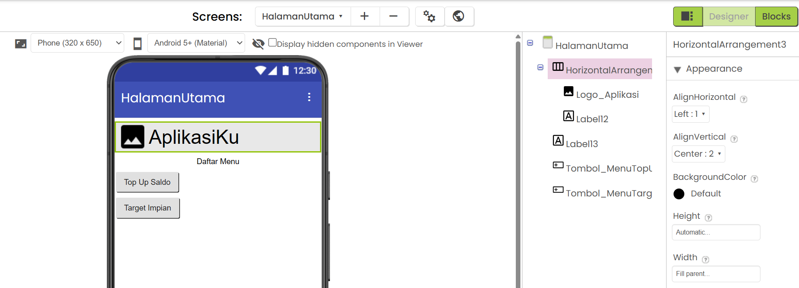
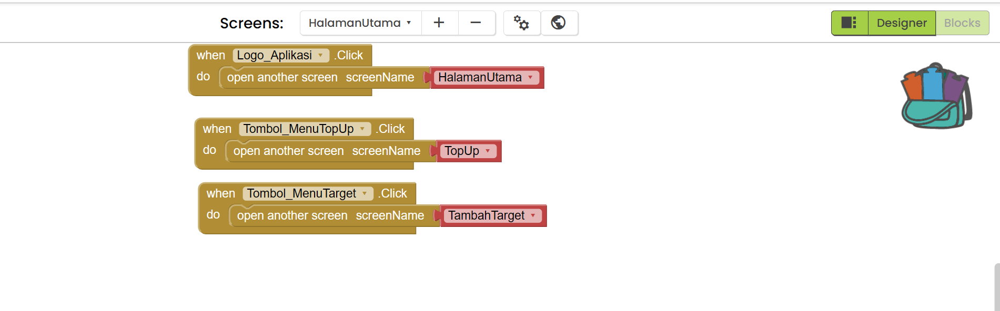
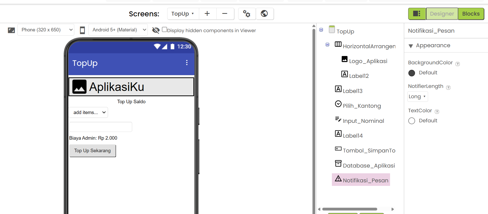
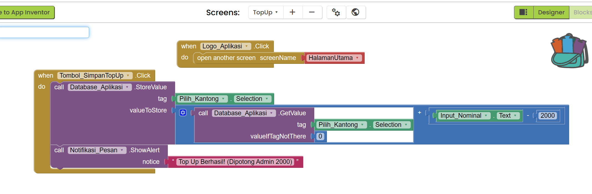

# Tutorial Membuat Aplikasi KELOMPOK 3 dengan MIT App Inventor

Pastikan Anda sudah login ke MIT App Inventor dan berada di tampilan **Designer** (tombol di pojok kanan atas).

Karena Anda sudah selesai dengan `Screen1` (Login), kita akan langsung membuat halaman selanjutnya sesuai konsep Anda (Halaman Utama, Top Up, dan Tambah Target).

---

## TAHAP 1: Membuat Screen Baru

Kita perlu membuat 3 Screen baru.

1. Di bagian atas layar, klik tombol **Add Screen**.
2. Ketik nama: `HalamanUtama` lalu klik OK.
3. Ulangi langkah 1, ketik nama: `TopUp` lalu klik OK.
4. Ulangi langkah 1, ketik nama: `TambahTarget` lalu klik OK.

_(Catatan: Pastikan penulisan nama Screen persis seperti di atas tanpa spasi)._

> **PENTING:** Silakan coba Run program, untuk memeriksa aplikasi apakah sudah benar tanpa error belum. Apabila ada error jangan lanjut ke tahap berikutnya.

---

## TAHAP 2: Desain & Blocks - HalamanUtama

Pastikan di bagian atas layar App Inventor, Anda sedang berada di Screen **HalamanUtama**. Di sini kita akan membuat Header dengan Logo terlebih dahulu, lalu membuat daftar menu berbentuk tombol.

**Preview Desain:**

### A. Desain (Designer)

1. **Membuat Header & Logo (Untuk di-copy nanti):**
   - Dari panel **Palette** > **Layout**, tarik **HorizontalArrangement** ke layar bagian paling atas.
   - Dari **Palette** > **User Interface**, tarik komponen **Image** ke dalam kotak HorizontalArrangement tadi.
   - Di panel **Components**, klik tombol **Rename Component** pada gambar tersebut, ubah namanya menjadi: `Logo_Aplikasi`.
   - Di panel **Properties**, cari kotak centang bernama **Clickable** dan **wajib dicentang** (agar logo bisa ditekan).
   - _(Opsional)_ Tarik **Label** di sebelah logo jika ingin memberi teks judul aplikasi.

2. **Membuat Menu Top Up:**
   - Lihat ke panel sebelah kiri bernama **Palette**. Di bawah kategori **User Interface**, cari komponen **Button**.
   - Tarik (drag) **Button** ke layar HP (Viewer) di bawah header.
   - Di panel **Properties** (paling kanan), ubah **Text** menjadi: `Menu Top Up Saldo`.
   - Di panel **Components** (tengah-kanan), klik tombol **Rename Component**, ubah namanya menjadi: `Tombol_MenuTopUp`.

3. **Membuat Menu Target Impian:**
   - Tarik lagi komponen **Button** ke bawah tombol pertama.
   - Di panel **Properties**, ubah **Text** menjadi: `Menu Target Impian`.
   - Di panel **Components**, klik **Rename Component**, ubah namanya menjadi: `Tombol_MenuTarget`.

---

### B. Kode (Blocks)

Sekarang kita buat agar logo dan tombol-tombol tersebut berfungsi memindahkan layar saat ditekan. Pindah ke tampilan **Blocks** (pojok kanan atas).

**Preview Blocks:**

**1. Logika Logo (Kembali ke Home):**

- Klik `Logo_Aplikasi` di panel kiri, tarik `when Logo_Aplikasi.Click do`.
- Dari kategori **Control**, tarik `open another screen screenName`. Isi dengan teks pink `"HalamanUtama"`. _(Blok ini juga akan ikut tercopy ke halaman lain nanti)._

**2. Logika Menu Top Up**

- Di panel **Blocks** sebelah kiri, klik `Tombol_MenuTopUp`.
- Tarik blok kuning paling atas: `when Tombol_MenuTopUp.Click do`.
- Klik kategori **Control** (warna cokelat/oranye). Scroll ke bawah, tarik blok `open another screen screenName`. Pasangkan ke dalam blok kuning tadi.
- Klik kategori **Text** (warna pink), tarik blok string kosong `" "` (paling atas) dan pasangkan ke sebelah `screenName`. Ketik di dalamnya: `TopUp`.

**3. Logika Menu Target Impian**

- Di panel kiri, klik `Tombol_MenuTarget`.
- Tarik blok kuning: `when Tombol_MenuTarget.Click do`.
- Klik kategori **Control**, tarik blok `open another screen screenName` dan pasangkan.
- Klik kategori **Text**, tarik blok `" "`, pasangkan dan ketik: `TambahTarget`.

> **PENTING:** Silakan coba Run program, untuk memeriksa aplikasi apakah sudah benar tanpa error belum. Apabila ada error jangan lanjut ke tahap berikutnya.

---

## TAHAP 3: Desain & Blocks - TopUp

Ganti screen aktif ke **TopUp** melalui dropdown Screen di atas. Di halaman ini kita membuat sistem potong admin Rp 2.000 untuk setiap Top Up yang masuk ke Kantong.

**Preview Desain:**

### A. Desain (Designer)

1. **Copy-Paste Header:**
   - Ganti screen kembali ke `HalamanUtama` sebentar.
   - Klik komponen `HorizontalArrangement` (Header) yang berisi Logo Anda.
   - Tekan tombol **Ctrl + C** (Copy) di keyboard Anda.
   - Ganti screen ke `TopUp`. Tekan tombol **Ctrl + V** (Paste). Header dan Logo akan otomatis muncul beserta blok logikanya!
2. **Pilih Kantong (Spinner):** Dari **Palette** > **User Interface**, tarik komponen **Spinner** ke layar.
   - Di **Properties**, cari **ElementsFromString** lalu ketik teks ini persis (tanpa spasi setelah koma): `Kantong_1,Kantong_2,Kantong_3`
   - Klik **Rename Component**, ubah menjadi: `Pilih_Kantong`.
3. **Input Nominal:** Dari **Palette** > **User Interface**, tarik komponen **TextBox**.
   - Di **Properties**, centang kotak **NumbersOnly**.
   - Ubah **Hint** menjadi: `Masukkan Nominal Top Up`.
   - Klik **Rename Component**, ubah menjadi: `Input_Nominal`.
4. **Info Admin:** Dari **Palette** > **User Interface**, tarik **Label**.
   - Di **Properties**, ubah Text: `Biaya Admin: Rp 2.000` (agar user tahu saldonya akan terpotong 2000).
5. **Tombol Top Up:** Dari **Palette** > **User Interface**, tarik komponen **Button**.
   - Di **Properties**, ubah **Text** menjadi: `Top Up Sekarang`.
   - Klik **Rename Component**, ubah menjadi: `Tombol_SimpanTopUp`.
6. **Database & Notifikasi:**
   - Dari **Palette** > **Storage**, tarik **TinyDB**. (Klik **Rename Component** jadi `Database_Aplikasi`).
   - Dari **Palette** > **User Interface**, tarik **Notifier**. (Klik **Rename Component** jadi `Notifikasi_Pesan`).

### B. Kode (Blocks)

Pindah ke tampilan **Blocks**. _(Catatan: Blok untuk Logo agar bisa kembali ke Halaman Utama sudah otomatis ada berkat proses copy-paste)._

**Preview Blocks:**

**Menyimpan Top Up dan Potong Admin**

1. Klik `Tombol_SimpanTopUp`, tarik blok kuning `when Tombol_SimpanTopUp.Click do`.
2. Klik `Database_Aplikasi`, tarik blok ungu `call Database_Aplikasi.StoreValue`. Masukkan ke blok kuning.
3. Di bagian `tag`: klik `Pilih_Kantong`, tarik blok hijau muda `Pilih_Kantong.Selection` (Ini agar uangnya masuk sesuai nama kantong yang dipilih di Spinner).
4. Di bagian `valueToStore`, kita akan tambahkan saldo lama dengan (Nominal baru - 2000).
   - Klik kategori **Math** (biru muda), tarik blok tambah `+`. Pasangkan ke `valueToStore`.
   - Di lubang **pertama** blok `+`: klik `Database_Aplikasi`, tarik blok ungu `call Database_Aplikasi.GetValue`. Isi `tag`-nya dengan blok hijau muda `Pilih_Kantong.Selection`. Isi `valueIfTagNotThere` dengan angka `0` (dari kategori Math).
   - Di lubang **kedua** blok `+`: klik kategori **Math**, tarik blok kurang `-`.
   - Di lubang pertama blok `-`: klik `Input_Nominal`, tarik blok hijau tua `Input_Nominal.Text`.
   - Di lubang kedua blok `-`: tarik angka `0` dari kategori Math, ubah angkanya jadi `2000`.
5. **Notifikasi Sukses:** Di panel kiri, klik `Notifikasi_Pesan`, tarik blok ungu `call Notifikasi_Pesan.ShowAlert notice`. Pasang di bawah StoreValue (di dalam blok kuning).
   - Isi `notice` dengan blok teks pink `" "` dan ketik: `Top Up Berhasil! (Dipotong Admin 2000)`.

> **PENTING:** Silakan coba Run program, untuk memeriksa aplikasi apakah sudah benar tanpa error belum. Apabila ada error jangan lanjut ke tahap berikutnya.

---

## TAHAP 4: Desain & Blocks - TambahTarget

Ganti screen aktif ke **TambahTarget** melalui dropdown Screen di atas.

**Preview Desain:**

### A. Desain (Designer)

1. **Paste Header:** Tekan tombol **Ctrl + V** (Paste) di keyboard Anda agar Header dan Logo kembali muncul di posisi paling atas layar ini.
2. **Input Nama Barang:** Tarik **TextBox**. Ubah Hint: `Nama Barang (Contoh: Sepatu)`. Rename Component: `Input_NamaBarang`.
3. **Input URL Link:** Tarik **TextBox**. Ubah Hint: `URL / Link Toko`. Rename Component: `Input_URL`.
4. **Input Harga:** Tarik **TextBox**. Centang **NumbersOnly**. Ubah Hint: `Harga Barang`. Rename Component: `Input_Harga`.
5. **Tombol Simpan:** Tarik **Button**. Ubah Text: `Simpan Target Impian`. Rename Component: `Tombol_SimpanTarget`.
6. **Database & Notifikasi:**
   - Tarik **TinyDB** dari Storage. (Rename Component jadi `Database_Aplikasi`).
   - Tarik **Notifier** dari User Interface. (Rename Component jadi `Notifikasi_Pesan`).

### B. Kode (Blocks)

Pindah ke tampilan **Blocks**. _(Blok kembali via Logo sudah ada otomatis)._

**Preview Blocks:**

**Menyimpan List Target Impian**

1. Kita buat variabel List. Di kategori **Variables** (oranye tua), tarik blok `initialize global name to`. Ganti `name` jadi `DaftarTarget`. Isi pasangannya dengan blok biru muda dari Lists: `create empty list`.
2. Klik `Tombol_SimpanTarget`, tarik blok kuning `when Tombol_SimpanTarget.Click do`.
3. Di dalam blok kuning: klik **Variables**, tarik blok `set to` dan pilih `global DaftarTarget`.
4. Pasangkan dengan blok ungu `call Database_Aplikasi.GetValue`. Isi `tag`-nya dengan teks pink `"DataTarget"`. Isi `valueIfTagNotThere` dengan blok biru muda `create empty list`.
5. Klik kategori **Lists**, tarik blok `add items to list`. Pasangkan di bawah blok `set global` tadi.
   - Di bagian `list`: isi dengan blok merah `get global DaftarTarget`.
   - Di bagian `item`: tarik blok pink `join` (ubah agar punya 5 lubang menggunakan ikon gir biru).
   - Isi lubang 1: `Input_NamaBarang.Text`
   - Isi lubang 2: Teks pink `" | Link: "`
   - Isi lubang 3: `Input_URL.Text`
   - Isi lubang 4: Teks pink `" | Rp "`
   - Isi lubang 5: `Input_Harga.Text`
6. Simpan list ke database. Tarik lagi blok ungu `call Database_Aplikasi.StoreValue`. Isi `tag` dengan teks pink `"DataTarget"`. Isi `valueToStore` dengan blok merah `get global DaftarTarget`.
7. **Notifikasi:** Tarik blok ungu `call Notifikasi_Pesan.ShowAlert notice`. Pasang di paling bawah dalam blok kuning. Isi teks pink `" "` dengan: `Target Impian Berhasil Disimpan!`.

> **PENTING:** Silakan coba Run program, untuk memeriksa aplikasi apakah sudah benar tanpa error belum. Apabila ada error jangan lanjut ke tahap berikutnya.

---

## CATATAN AKHIR

1. **Jangan lupa di save** project Anda di MIT App Inventor.
2. **Ini Hanya prototype saja** alias aplikasi mu belum selesai. Lanjutkan desain secantik mungkin pada masing-masing halaman. Hati-hati saat mendesain agar fitur (Blocks) yang sudah ada tidak error.
