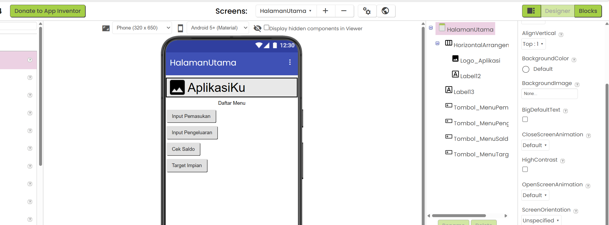
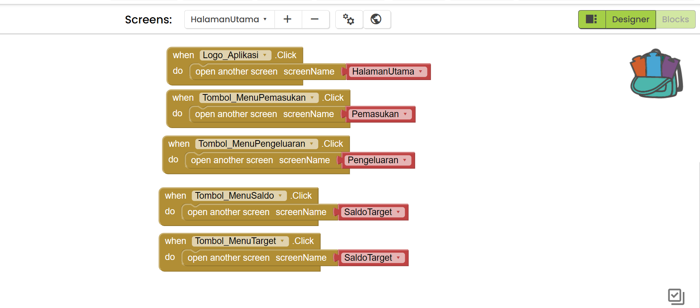
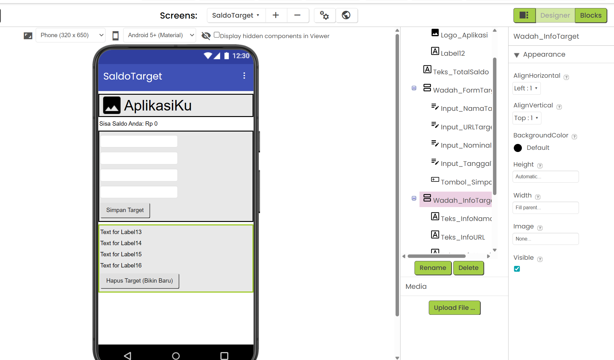
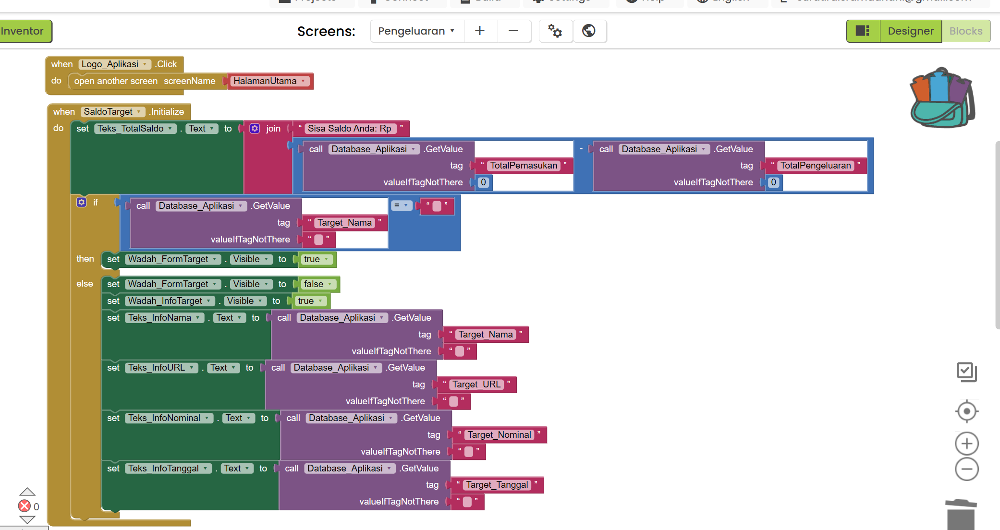
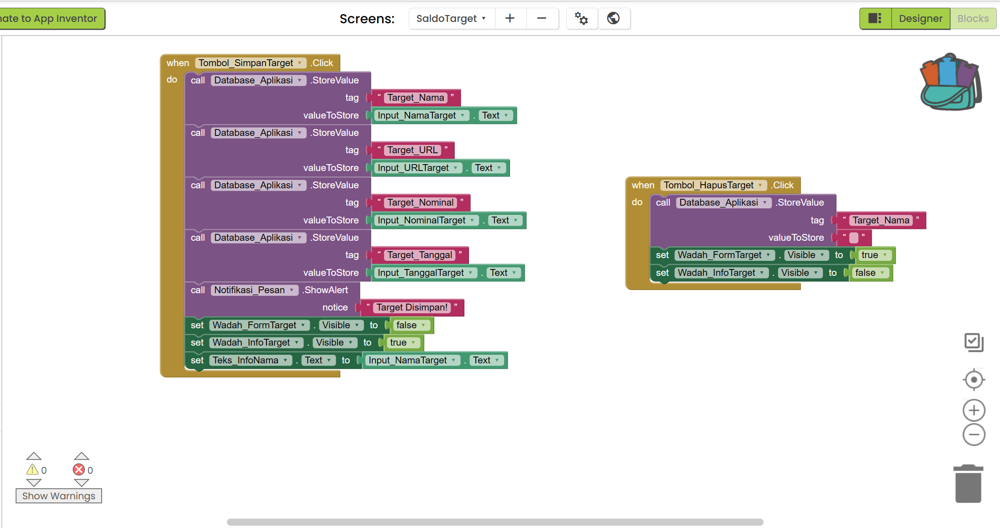

# Tutorial Membuat Aplikasi KELOMPOK 4 dengan MIT App Inventor

Pastikan Anda sudah login ke MIT App Inventor dan berada di tampilan **Designer** (tombol di pojok kanan atas).

Karena Anda sudah selesai dengan `Screen1` (Login), kita akan langsung membuat halaman selanjutnya sesuai dengan konsep manajemen keuangan dan target impian Anda.

---

## TAHAP 1: Membuat Screen Baru

Kita perlu membuat 4 Screen baru.

1. Di bagian atas layar, klik tombol **Add Screen**.
2. Ketik nama: `HalamanUtama` lalu klik OK.
3. Ulangi langkah 1, ketik nama: `SaldoTarget` lalu klik OK.
4. Ulangi langkah 1, ketik nama: `Pemasukan` lalu klik OK.
5. Ulangi langkah 1, ketik nama: `Pengeluaran` lalu klik OK.

_(Catatan: Pastikan penulisan nama Screen persis seperti di atas tanpa spasi)._

> **PENTING:** Silakan coba Run program, untuk memeriksa aplikasi apakah sudah benar tanpa error belum. Apabila ada error jangan lanjut ke tahap berikutnya.

---

## TAHAP 2: Desain & Blocks - HalamanUtama

Pastikan screen aktif di bagian atas adalah **HalamanUtama**. Di sini kita akan membuat Header dengan Logo terlebih dahulu, lalu membuat 4 tombol menu utama.

**Preview Desain:**

### A. Desain (Designer)

1. **Membuat Header & Logo (Untuk di-copy nanti):**
   - Dari panel **Palette** > **Layout**, tarik **HorizontalArrangement** ke layar bagian paling atas.
   - Dari **Palette** > **User Interface**, tarik komponen **Image** ke dalam kotak HorizontalArrangement tadi.
   - Di panel **Components**, klik tombol **Rename Component** pada gambar tersebut, ubah namanya menjadi: `Logo_Aplikasi`.
   - Di panel **Properties**, cari kotak centang bernama **Clickable** dan **wajib dicentang** (agar logo bisa ditekan).
   - _(Opsional)_ Tarik **Label** di sebelah logo jika ingin memberi teks judul aplikasi.

2. **Membuat Menu Pemasukan:**
   - Dari panel **Palette** > **User Interface**, tarik komponen **Button** ke layar HP (Viewer) di bawah header.
   - Ubah **Text** di Properties menjadi: `Input Pemasukan`. Lalu klik **Rename Component** menjadi: `Tombol_MenuPemasukan`.

3. **Membuat Menu Pengeluaran:**
   - Tarik **Button** lagi ke bawahnya.
   - Ubah **Text** menjadi: `Input Pengeluaran`. Klik **Rename Component** menjadi: `Tombol_MenuPengeluaran`.

4. **Membuat Menu Saldo:**
   - Tarik **Button** lagi ke bawahnya.
   - Ubah **Text** menjadi: `Cek Saldo`. Klik **Rename Component** menjadi: `Tombol_MenuSaldo`.

5. **Membuat Menu Target:**
   - Tarik **Button** lagi ke bawahnya.
   - Ubah **Text** menjadi: `Target Impian`. Klik **Rename Component** menjadi: `Tombol_MenuTarget`.

---

### B. Kode (Blocks)

Sekarang kita buat agar logo dan tombol-tombol tersebut berfungsi memindahkan layar saat ditekan. Pindah ke tampilan **Blocks** (pojok kanan atas).

**Preview Blocks:**

**1. Logika Logo (Kembali ke Home):**

- Klik `Logo_Aplikasi` di panel kiri, tarik `when Logo_Aplikasi.Click do`.
- Dari kategori **Control**, tarik `open another screen screenName`. Isi dengan teks pink `"HalamanUtama"`. _(Blok ini juga akan ikut tercopy ke halaman lain nanti)._

**2. Logika Menu Pemasukan:** - Klik `Tombol_MenuPemasukan`, tarik `when Tombol_MenuPemasukan.Click do`. Dari kategori **Control**, tarik `open another screen screenName`. Isi dengan teks pink `"Pemasukan"`.

**3. Logika Menu Pengeluaran:** - Klik `Tombol_MenuPengeluaran`, tarik `when Tombol_MenuPengeluaran.Click do`. Tarik blok buka layar, isi dengan teks pink `"Pengeluaran"`.

**4. Logika Menu Saldo & Target:** - Klik `Tombol_MenuSaldo`, tarik `when Tombol_MenuSaldo.Click do`. Tarik blok buka layar, isi dengan teks pink `"SaldoTarget"`.

- Klik `Tombol_MenuTarget`, tarik `when Tombol_MenuTarget.Click do`. Tarik blok buka layar, isi dengan teks pink `"SaldoTarget"`. _(Catatan: Menu Saldo dan Target diarahkan ke layar yang sama sesuai konsep)._

> **PENTING:** Silakan coba Run program, untuk memeriksa aplikasi apakah sudah benar tanpa error belum. Apabila ada error jangan lanjut ke tahap berikutnya.

---

## TAHAP 3: Desain & Blocks - SaldoTarget

Ganti screen aktif ke **SaldoTarget**. Di sini kita akan membuat sistem perhitungan saldo otomatis dan form target yang bisa disembunyikan.

**Preview Desain:**

### A. Desain (Designer)

1. **Copy-Paste Header:**
   - Ganti screen kembali ke `HalamanUtama` sebentar.
   - Klik komponen `HorizontalArrangement` (Header) yang berisi Logo Anda.
   - Tekan tombol **Ctrl + C** (Copy) di keyboard Anda.
   - Ganti screen ke `SaldoTarget`. Tekan tombol **Ctrl + V** (Paste). Header dan Logo akan otomatis muncul beserta blok logikanya!
2. **Info Saldo:** Tarik **Label**. Ubah Text menjadi: `Sisa Saldo Anda: Rp 0`. Perbesar ukuran font, dan centang FontBold. Rename Component menjadi: `Teks_TotalSaldo`.
3. **Wadah Form Target:** Dari **Palette** > **Layout**, tarik **VerticalArrangement**. Rename Component menjadi: `Wadah_FormTarget`.
   - Di dalam wadah ini, tarik 4 **TextBox**:
     - TextBox 1 -> Hint: `Nama Barang`, Rename Component: `Input_NamaTarget`.
     - TextBox 2 -> Hint: `URL / Link Barang`, Rename Component: `Input_URLTarget`.
     - TextBox 3 -> Hint: `Nominal Target`, Centang _NumbersOnly_, Rename Component: `Input_NominalTarget`.
     - TextBox 4 -> Hint: `Tanggal (Due Date)`, Rename Component: `Input_TanggalTarget`.
   - Tarik 1 **Button** ke dalam wadah ini. Ubah Text: `Simpan Target`. Rename Component: `Tombol_SimpanTarget`.
4. **Wadah Info Target (Jika Target Sudah Ada):** Tarik **VerticalArrangement** baru ke bawah layar. Rename Component: `Wadah_InfoTarget`.
   - Di dalam wadah ini, tarik 4 **Label** berurutan ke bawah. Rename Component masing-masing menjadi: `Teks_InfoNama`, `Teks_InfoURL`, `Teks_InfoNominal`, `Teks_InfoTanggal`. (Isi Text-nya biarkan bawaan dulu).
   - Tarik 1 **Button** ke dalam wadah ini. Ubah Text: `Hapus Target (Bikin Baru)`. Rename Component: `Tombol_HapusTarget`.
   - **PENTING:** Di panel Properties `Wadah_InfoTarget`, hilangkan centang **Visible** (agar disembunyikan saat layar pertama kali dibuka).
5. **Database & Notifikasi:** - Tarik **TinyDB** dari Storage (Rename Component: `Database_Aplikasi`).
   - Tarik **Notifier** dari User Interface (Rename Component: `Notifikasi_Pesan`).

### B. Kode (Blocks)

Pindah ke tampilan **Blocks**. _(Catatan: Blok untuk Logo agar bisa kembali ke Halaman Utama sudah otomatis ada berkat proses copy-paste)._

**Preview Blocks:**

**Bagian 1: Memuat Data Saat Layar Dibuka**

1. Di panel **Blocks** sebelah kiri, klik komponen `SaldoTarget` (ikon layar paling atas). Tarik blok kuning: `when SaldoTarget.Initialize do`.
2. **Hitung Saldo:** - Klik `Teks_TotalSaldo` di panel kiri, tarik blok hijau muda: `set Teks_TotalSaldo.Text to`. Masukkan ke dalam blok kuning tadi.
   - Klik kategori **Text** (warna pink), tarik blok `join` dan pasangkan ke sebelah kanan blok hijau.
   - Di lubang pertama blok `join`: klik kategori **Text**, tarik blok teks pink kosong `" "`, lalu ketik di dalamnya: `Sisa Saldo Anda: Rp ` (pastikan ada spasi setelah huruf p).
   - Di lubang kedua blok `join`: klik kategori **Math** (biru muda), tarik blok kurang `-`.
   - Di lubang kiri blok `-`: klik `Database_Aplikasi` di panel kiri, tarik blok ungu `call Database_Aplikasi.GetValue`.
     - Isi `tag`-nya dengan blok teks pink `" "` dan ketik: `TotalPemasukan`.
     - Isi `valueIfTagNotThere` dengan angka `0` dari kategori **Math**.
   - Di lubang kanan blok `-`: tarik lagi blok ungu `call Database_Aplikasi.GetValue`.
     - Isi `tag`-nya dengan blok teks pink `" "` dan ketik: `TotalPengeluaran`.
     - Isi `valueIfTagNotThere` dengan angka `0` dari kategori **Math**.
3. **Cek Target:** - Klik kategori **Control** (warna cokelat/oranye), scroll ke bawah, tarik blok `if then else` dan pasangkan di bawah blok hijau `set Saldo` (masih di dalam blok kuning Initialize).
   - **Di bagian `if`:** Klik kategori **Logic** (hijau terang), tarik blok sama dengan `=`.
     - Sisi kiri blok `=`: tarik blok ungu `call Database_Aplikasi.GetValue`. Isi `tag`-nya dengan teks pink `"Target_Nama"`. Isi `valueIfTagNotThere` dengan teks pink kosong `" "`.
     - Sisi kanan blok `=`: tarik blok teks pink kosong `" "` dari kategori **Text**.
   - **Di bagian `then`:** - Klik `Wadah_FormTarget`, tarik blok hijau muda `set Wadah_FormTarget.Visible to`. Pasangkan blok dari kategori **Logic** yaitu `true`.
     - Klik `Wadah_InfoTarget`, tarik blok hijau muda `set Wadah_InfoTarget.Visible to`. Pasangkan blok dari kategori **Logic** yaitu `false`.
   - **Di bagian `else`:** - Klik `Wadah_FormTarget`, tarik blok hijau muda `set Wadah_FormTarget.Visible to`. Pasangkan blok `false`.
     - Klik `Wadah_InfoTarget`, tarik blok hijau muda `set Wadah_InfoTarget.Visible to`. Pasangkan blok `true`.
     - _(Menampilkan info dari database ke layar)_: Klik `Teks_InfoNama`, tarik `set Teks_InfoNama.Text to`. Pasangkan dengan blok ungu `call Database_Aplikasi.GetValue`. Isi `tag`-nya dengan teks pink `"Target_Nama"`, dan `valueIfTagNotThere` dengan teks pink `" "`.
     - Ulangi langkah persis seperti di atas untuk `Teks_InfoURL` (isi tag: `"Target_URL"`), `Teks_InfoNominal` (isi tag: `"Target_Nominal"`), dan `Teks_InfoTanggal` (isi tag: `"Target_Tanggal"`).

**Bagian 2: Tombol Simpan & Hapus Target**

1. **Tombol Simpan:** - Di panel kiri, klik `Tombol_SimpanTarget`, tarik blok kuning `when Tombol_SimpanTarget.Click do`.
   - Kita butuh menyimpan 4 data. Klik `Database_Aplikasi`, tarik blok ungu `call Database_Aplikasi.StoreValue`. Pasangkan ke dalam blok kuning. Ulangi langkah ini sampai ada **4 blok ungu StoreValue** tersusun ke bawah.
   - Blok ungu ke-1: Isi `tag` dengan teks pink `"Target_Nama"`. Isi `valueToStore` dengan klik `Input_NamaTarget` di panel kiri, lalu tarik blok hijau tua `Input_NamaTarget.Text`.
   - Blok ungu ke-2: Isi `tag` dengan teks pink `"Target_URL"`. Isi `valueToStore` dengan blok hijau tua `Input_URLTarget.Text`.
   - Blok ungu ke-3: Isi `tag` dengan teks pink `"Target_Nominal"`. Isi `valueToStore` dengan blok hijau tua `Input_NominalTarget.Text`.
   - Blok ungu ke-4: Isi `tag` dengan teks pink `"Target_Tanggal"`. Isi `valueToStore` dengan blok hijau tua `Input_TanggalTarget.Text`.
   - **Munculkan Notifikasi:** Klik `Notifikasi_Pesan` di panel kiri, tarik blok ungu `call Notifikasi_Pesan.ShowAlert notice`. Pasang di bawah susunan StoreValue tadi. Isi `notice`-nya dengan teks pink `"Target Disimpan!"`.
   - **Ganti Tampilan Layar:**
     - Klik `Wadah_FormTarget`, tarik `set Wadah_FormTarget.Visible to` dan isi dengan blok `false` (dari kategori Logic).
     - Klik `Wadah_InfoTarget`, tarik `set Wadah_InfoTarget.Visible to` dan isi dengan blok `true`.
   - **Update Teks Info:** Klik `Teks_InfoNama`, tarik `set Teks_InfoNama.Text to`, lalu pasangkan dengan blok hijau tua `Input_NamaTarget.Text`. Lakukan hal yang sama untuk Teks Info URL, Nominal, dan Tanggal.
2. **Tombol Hapus:** - Di panel kiri, klik `Tombol_HapusTarget`, tarik blok kuning `when Tombol_HapusTarget.Click do`.
   - Klik `Database_Aplikasi`, tarik blok ungu `call Database_Aplikasi.StoreValue`.
   - Isi `tag` dengan teks pink `"Target_Nama"`.
   - Isi `valueToStore` dengan teks pink kosong `" "`. (Ini berfungsi me-reset status target di database).
   - **Balikkan Tampilan Layar:**
     - Klik `Wadah_FormTarget`, tarik `set Wadah_FormTarget.Visible to` dan isi dengan blok `true`.
     - Klik `Wadah_InfoTarget`, tarik `set Wadah_InfoTarget.Visible to` dan isi dengan blok `false`.

> **PENTING:** Silakan coba Run program, untuk memeriksa aplikasi apakah sudah benar tanpa error belum. Apabila ada error jangan lanjut ke tahap berikutnya.

---

## TAHAP 4: Desain & Blocks - Pemasukan

Ganti screen aktif ke **Pemasukan**.

**Preview Desain:**

### A. Desain (Designer)

1. **Paste Header:** Tekan tombol **Ctrl + V** (Paste) di keyboard Anda agar Header dan Logo kembali muncul di posisi paling atas layar ini.
2. Tarik **TextBox**, centang _NumbersOnly_, Hint: `Nominal Pemasukan`, Rename Component: `Input_Pemasukan`.
3. Tarik **Button**, Text: `Simpan Pemasukan`, Rename Component: `Tombol_SimpanPemasukan`.
4. Tarik **TinyDB** (Rename Component: `Database_Aplikasi`) dan **Notifier** (Rename Component: `Notifikasi_Pesan`).

### B. Kode (Blocks)

Pindah ke tampilan **Blocks**. _(Blok kembali via Logo sudah ada otomatis)._

**Preview Blocks:**

1. Klik `Tombol_SimpanPemasukan`, tarik `when Click do`.
2. Tarik `call Database_Aplikasi.StoreValue`. Isi tag dengan teks pink `"TotalPemasukan"`.
3. Di bagian `valueToStore`, tarik blok Math tambah `+`.
   - Sisi kiri: tarik `call Database_Aplikasi.GetValue`, isi tag `"TotalPemasukan"`, default `0` (Mengambil total pemasukan yang sudah ada sebelumnya).
   - Sisi kanan: tarik `Input_Pemasukan.Text` (Menambahkan dengan yang baru).
4. Tarik blok `ShowAlert` Notifier, isi pesan `"Pemasukan Berhasil Ditambah!"`.

> **PENTING:** Silakan coba Run program, untuk memeriksa aplikasi apakah sudah benar tanpa error belum. Apabila ada error jangan lanjut ke tahap berikutnya.

---

## TAHAP 5: Desain & Blocks - Pengeluaran

Ganti screen aktif ke **Pengeluaran**. (Tahap ini hampir sama persis dengan Pemasukan).

**Preview Desain:**

### A. Desain (Designer)

1. **Paste Header:** Tekan tombol **Ctrl + V** (Paste) di keyboard Anda agar Header dan Logo kembali muncul.
2. Tarik **TextBox**, centang _NumbersOnly_, Hint: `Nominal Pengeluaran`, Rename Component: `Input_Pengeluaran`.
3. Tarik **Button**, Text: `Simpan Pengeluaran`, Rename Component: `Tombol_SimpanPengeluaran`.
4. Tarik **TinyDB** (Rename Component: `Database_Aplikasi`) dan **Notifier** (Rename Component: `Notifikasi_Pesan`).

### B. Kode (Blocks)

Pindah ke tampilan **Blocks**. _(Blok kembali via Logo sudah ada otomatis)._

**Preview Blocks:**

1. Klik `Tombol_SimpanPengeluaran`, tarik `when Click do`.
2. Tarik `call Database_Aplikasi.StoreValue`. Isi tag dengan teks pink `"TotalPengeluaran"`.
3. Di bagian `valueToStore`, tarik blok Math tambah `+`.
   - Sisi kiri: tarik `call Database_Aplikasi.GetValue`, isi tag `"TotalPengeluaran"`, default `0`.
   - Sisi kanan: tarik `Input_Pengeluaran.Text`.
   - _(Catatan: Di sini kita menjumlahkan total pengeluarannya, pengurangannya terjadi nanti di halaman Saldo)._
4. Tarik blok `ShowAlert` Notifier, isi pesan `"Pengeluaran Berhasil Dicatat!"`.

> **PENTING:** Silakan coba Run program, untuk memeriksa aplikasi apakah sudah benar tanpa error belum. Apabila ada error jangan lanjut ke tahap berikutnya.

---

## CATATAN AKHIR

1. **Jangan lupa di save** project Anda di MIT App Inventor.
2. **Ini Hanya prototype saja** alias aplikasi mu belum selesai. Lanjutkan desain secantik mungkin pada masing-masing halaman. Hati-hati saat mendesain agar fitur (Blocks) yang sudah ada tidak error.
